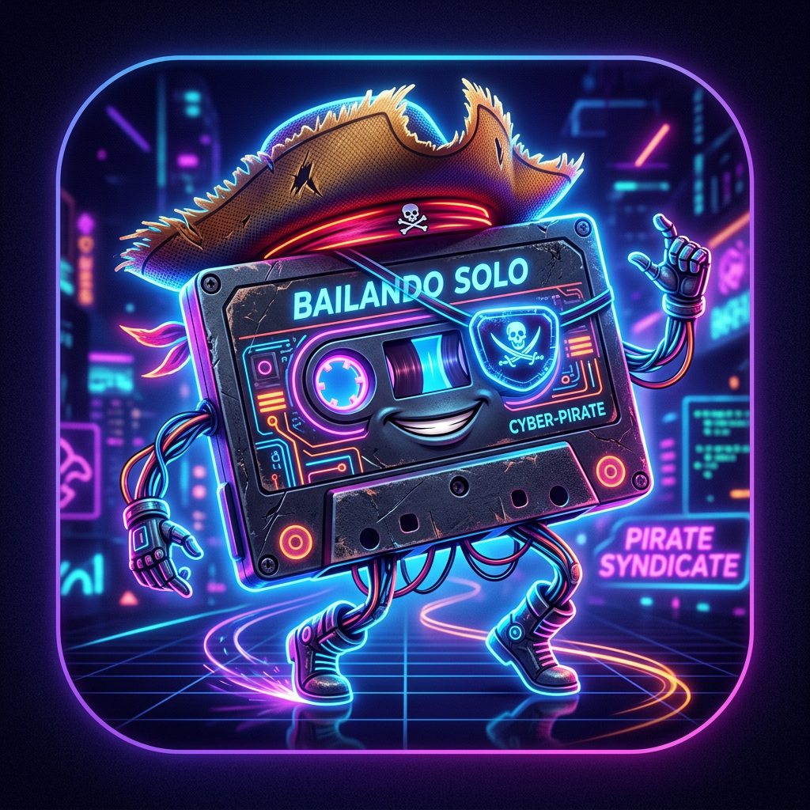
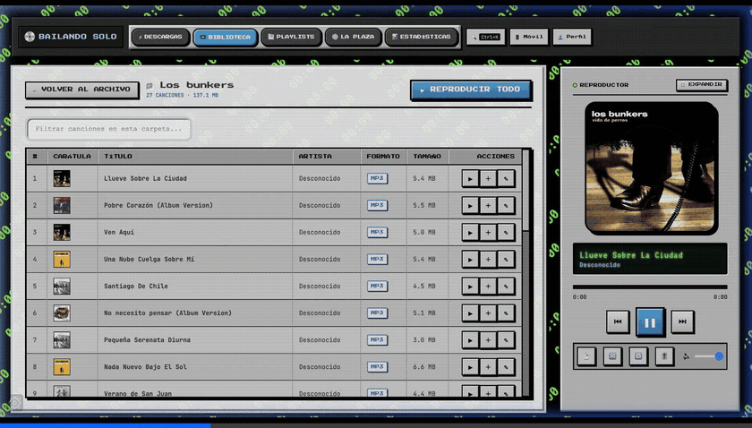
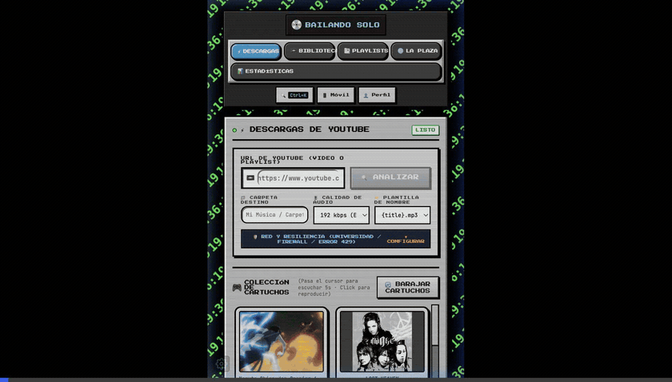
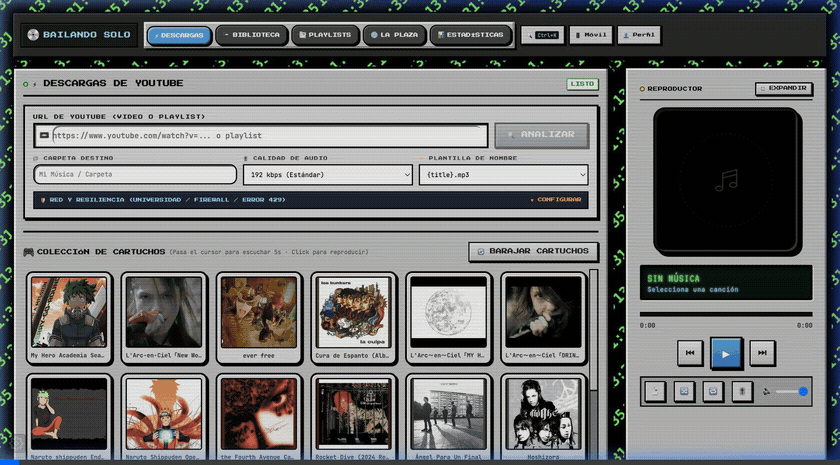
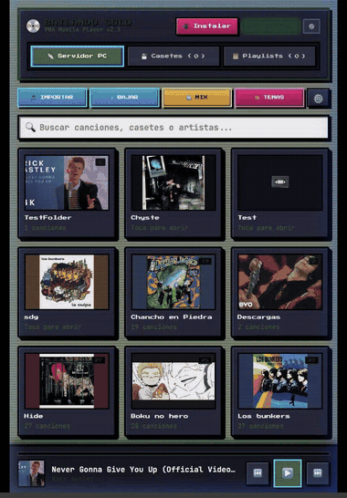

# 📼 Bailando Solo

<p align="center">
  
</p>

<p align="center">
  <strong>Tu música. Tus reglas. Tu disco duro.</strong><br>
  <em>Reproductor y descargador retro para los que no quieren pagar arriendo mensual por escuchar música.</em>
</p>

<p align="center">
  
  
  
  
</p>

---

## ⚡ ¿Por qué existe?

Pagar $12 USD al mes para que un día te borren canciones por "problemas de licencia" es ridículo.

**Bailando Solo** baja música desde YouTube, la guarda en tu disco duro y la reproduce con interfaz de consola clásica. Sin cuentas, sin algoritmos invasivos y sin suscripciones.

---

## 🕹️ Estudio Desktop & Temas Retro

<p align="center">
  
</p>

* **Visualizador FFT:** Frecuencias en tiempo real estilo minicomponente noventero.
* **Ecualizador multibanda:** Control manual de graves y agudos.
* **Temas al instante:** SNES 🕹️, PlayStation 2 🌌, Wii U 🎮, Cassette 📼 y Puerto Montt 🌧️ (con lluvia animada).

---

## 📼 Casetes y Carpetas Locales

<p align="center">
  
</p>

* **Colección tangible:** Organizada en casetes y carpetas físicas, no en listas infinitas.
* **Buscador global (`Ctrl+K`):** Filtra temas y carpetas en milisegundos.
* **Multi-perfil:** Carpetas aisladas por usuario para no mezclar gustos incompatibles.

---

## 📥 Descargas y Sala Arcade

<p align="center">
  
</p>

* **Descargas hasta 320 kbps:** Videos sueltos o playlists completas impulsadas por `yt-dlp`.
* **Nombres limpios:** Plantillas automáticas estilo `{artist} - {title}.mp3`.
* **Logros Arcade:** Estadísticas de horas escuchadas, giros de disco y trofeos retro sin tener que esperar un "Wrapped" a fin de año.

---

## 📱 Móvil PWA (Sin App Store)

<p align="center">
  
</p>

Escanea el código QR desde tu PC y listo. Sin descargar 300MB de una tienda:

* **Casetes Offline:** Guarda álbumes enteros en la memoria del teléfono (IndexedDB) para escuchar sin señal.
* **Descarga directa:** Exporta carpetas completas en `.zip` o `.mp3`.
* **Control remoto:** Controla el reproductor del computador desde la cama.
* **Temas Game Boy y Cyberpunk.**

---

## 🌐 La Plaza (P2P Nostr)

Comparte playlists e intercambia música con otros usuarios mediante relays descentralizados de Nostr. Sin cuentas, sin contraseñas y sin intermediarios registrando lo que escuchas.

---

## 🚀 Instalación Rápida

### Para mortales
Descarga el instalador directo en [**Releases**](../../releases):
* **Windows:** `.exe`
* **Linux:** `.AppImage` o `.deb`
* **macOS:** `.dmg`

### Para desarrolladores
```bash
# Iniciar en desarrollo (levanta Python, Flask, Vite y Electron juntos)
chmod +x start.sh && ./start.sh
```

**Compilar instaladores:**
```bash
# 1. Compilar backend
chmod +x build_backend.sh && ./build_backend.sh

# 2. Empaquetar Electron
npm run dist
```

---

## 📂 Privacidad

Tus archivos y datos viven solo en tu equipo:
* **macOS / Linux:** `~/.bailandosolo/`
* **Windows:** `C:\Users\TuUsuario\.bailandosolo\`

Borras esa carpeta y no queda rastro en ningún servidor.

---

## ⚠️ Disclaimer

Esto es software libre, igual que un martillo o `ffmpeg`. Lo que descargues es responsabilidad tuya y de tu consciencia. Úsalo con criterio. 😉